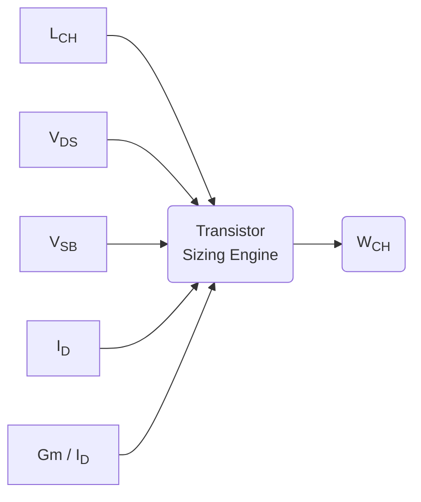
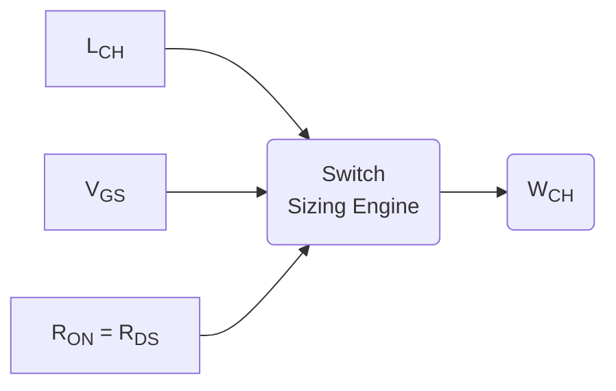
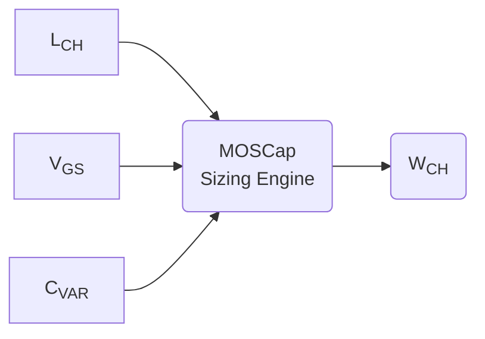
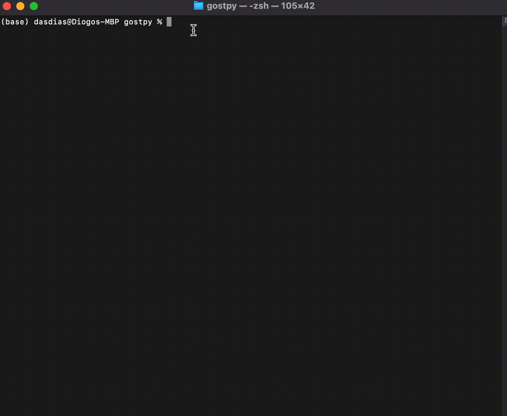
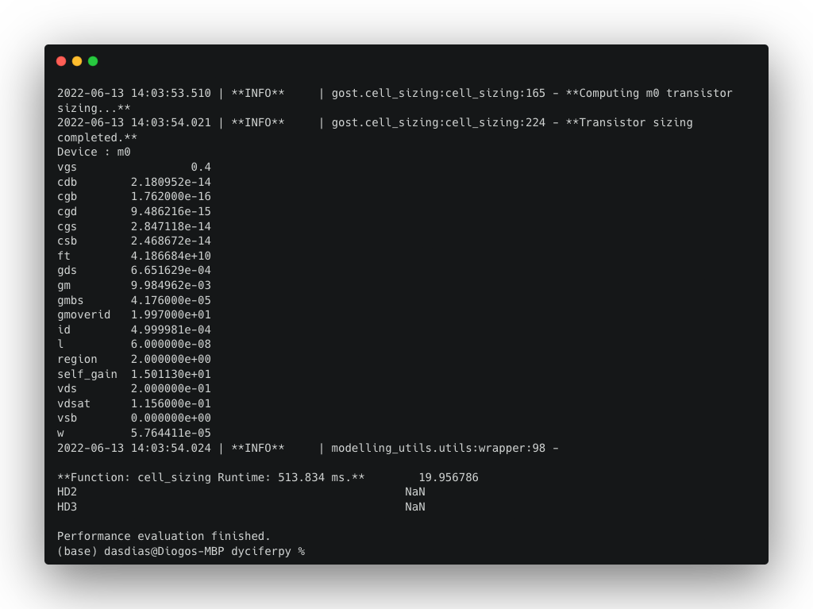

   


# GOST - Gm Over id Sizing Tool

```GOST``` is a tool dedicated to aiding analog integrated circuit designers sizing the devices integrating the circuits being designed through the use of the Gm (transconductance) over Id (Drain-Source) (Gm/Id) design methodology.

## Summary

The tool allows for the sizing of three possible CMOS devices:

- CMOS Transistors
- CMOS Switches
- CMOS Varactors (MOSCap)

The tool works in a very simple manner. The engineer himself needs to obtain the look up tables (LUTs) through simulation. The obtained LUTs must be in comma separated values (.CSV) format, and must have the exact topology as the LUTs already present in the ```src/data``` directory. These LUTs obtained in simulation must be inserted into the ```src/data/input``` directory, in which each set of LUTs for the correspondent device type must be inserted into its correspondent directory:

- Transistor related LUTs into ```src/data/input/ncell``` and ```src/data/input/pcell``` for NMOS and PMOS devices, respectively
- Switch related LUTs into ```src/data/input/nswitch``` and ```src/data/input/pswitch``` for NMOS and PMOS devices, respectively
- Varactor related LUTs into ```src/data/input/nvaractor``` and ```src/data/input/pvaractor``` for NMOS and PMOS devices, respectively

After providing the necessary simulation data to the input directory, the tool will perform conditional searches in the database and afterwards apply the Gm/Id method in order to provide the necessary Channel Width (Wch) and Gate-to-Source (Vgs) voltage that allow to obtain a device that meets the design requirements laid out by the designer.

## Dependencies

- ```Poetry``` - [Poetry]((https://python-poetry.org/docs/)) is ®Python language’s most famous and best package manager, allowing to quickly deploy any application or package.
- SPICE simulation-generated look up tables with each device type’s direct-current (DC) operating point (OP). The data available in ```src/data/input``` was generated using ```Cadence-Virtuoso``` software, and relates to a 28 nm TSMC CMOS technology.

Package dependencies can be found [here](./docs/dependencies.md).

## Installation 

It is highly recommended to use ```Poetry``` in order to install ```GOST``` because it will automatically setup the virtual environment and package dependencies necessary to run this tool. \
First of all, ```git-clone``` this repository into a directory:

```
git clone https://github.com/das-dias/gostpy.git
```

Alternatively, you can [download](URL "https://github.com/das-dias/gostpy/archive/refs/heads/master.zip") this repo's ```.zip``` file and extract it into a personal directory, if you don't have [git](URL "https://git-scm.com/book/en/v2/Getting-Started-Installing-Git") installed in your machine.

Next, using ```Poetry```, inside the downloaded repository directory, run the installation command:

```
poetry install
```

## Methodology

The sizing of each type of N-channel (nch) or P-channel (pch) CMOS device is bound by its specific set of degrees of freedom (DOF):

- CMOS Transistors:
    - Degrees of Freedom (DOF):
        - Channel Length (Lch)
        - Drain-to-Source (Vds) voltage - controlling the saturation level of the channel, very dependant of the circuit topology
        - Gm/Id - controlling the transconductance efficiency of the device
        - Source-to-Bulk(Back Gate) Voltage (Vsb) - controlling the threshold voltage necessary to place the device in the saturation region, and often directly dependant on the circuit topology
- CMOS Switches:
    - Degrees of Freedom (DOF):
        - Channel Length(Lch) - not really a DOF, because in order to minimize switch On-Resistance while maximising switching speed one must use minimum Length
        - Gate-to-Source (Vgs) voltage - controlling the inversion level of the channel, and thus modulating the total resistance offered by the channel when conducting current. This is not really a DOF as well, because Vgs = VDD always minimizes the On-Resistance of the channel, while allowing for the maximum operating frequency (ft) of the device
        - Output Resistance (Rds) - the required Drain-Output resistance for the switch, bound by distortion and gain specifications
- CMOS Varactors:
    - Degrees of Freedom (DOF):
        - Channel Length (Lch)
        - Gate-to-Source (Vgs) voltage - controlling the inversion level of the channel, and thus modulating the total Gate-Capacitance of the device (maximising it for maximum Vgs). Usually Vgs is bound by circuit topology, and thus it is not really a DOF.
        - Total MOSCap capacitancein inversion (Cvar) - the total capacitance that the designer wants to observe at the gate terminal of the device (high-impedance terminal) during the phase in which the device is considered to be in the inversion region (the channel is inverted - for Vgs > Vth).

All the aforementioned DOF will enable the generation of a ```Channel Width (Wch)``` that allows for each device to accomplish its design specification (Gm/Id for transistors, Ron for switches and Cvar for MOSCaps). The operation of the tool can then be summarised in the following system diagrams:


Diagram 1 - CMOS Transistor sizing method using Gm/Id methodology.


Diagram 2 - CMOS Switch sizing method using Gm/Id methodology.

Diagram 3 - MOSCap sizing method using Gm/Id methodology.
## How to Use

```GOST``` is an application based on a command-line interface (CLI) that allows the user to interact with the application itself, and therefore the use of the app is based on the parsing of commands and its associated parameters in order to generate an output based on the given input of the user. Some examples are given on how to interact with the tool.

---

### Asking for Help

*Main-frame*

In order to observe the sub-processes that are embedded into the tool, one can call for help in its main-frame:

```
poetry run gost -h
```
OR
```
poetry run gost —help
```



---
*Device Sizing Secondary-Frames:*

Each sub-frame has its own ```help``` console output, and one can call it by simply typing into console the call of the ```GOST``` application, followed by the sub-frame we want to call (depending on the kind of device we want to size) and the help command. For example, if we want some help on sizing multiple CMOS switches using a ```.TOML``` file for the input of switch specifications we can run the following command:

```
poetry run gost switch-sizing -h
```

OR

```
poetry run gost switch-sizing —help
```

As stated before, the supports the sizing of multiple devices (of the same type) at once through the use of a ```.TOML``` file to parse specifications for each device to design into the application, and also supports the sizing of a single device of any type by parsing the device’s specifications directly from console into the tool.

---

### Sizing a single device

An example regarding the sizing operation of a single transistor using console parsing is given in the following snippet.

```
poetry run gost single-cell-sizing -t nch -vds “200 m” -vsb 0.0 -l “60 n” -gi 20 -id “500 u”
```

In this snippet, an NMOS (```-t nch```) transistor device is being sized, in which its:

- expected Vds is 200 milivolt (mV)
- bound Vsb (Source-Bulk voltage) is 0 volt (V) - thus eliminating the *Body Effect*
- Channel Length is 2x the minimum channel length of the 28 nm tech. node (60 nanometers)
- The device is expected to operate with a transconductance efficiency (Gm/Id) of 20 V^{-1} (```-gi 20```)
- The polarising current of the transistor’s channel (Id) is 500 micro-ampere (uA)

The obtained console output for these sizing parameters is currently computed through the performance of a table query to obtain the scaled Channel Width of the device (through the Gm/Id sizing methodology) that allows for the accomplishment of the specified Drain current -Id. 

The console output for the previous command will be as such:



Graphical results will also be generated when performing transistor and switch sizing operations. In the case of the sizing of transistors, the graphs will present the curves of dependance between the transistor’s intrinsic gain, maximum operating frequency and transconductance efficiency towards the variation of the level of inversion through the variation of the Vgs voltage.


---

### Sizing multiple devices automatically

Instead of parsing each devices specification through console parsing, it is also possible to write a Tom’s Obvious Minimal Language (TOML) file stating the specifications for each device of the same class (transistor, switch or MOSCap). This ```.toml``` file can then be parsed to the tool through dedicated commands and the devices will be automatically sized.

Given the example of the following ```.toml``` file containing the design specifications for 4 CMOS switches:

```TOML
#file-name: foo/bar/switch_specs.toml

[control] # control parameters for each device of the circuit
switches=["s0","s1","s2","s3"]
s0={type="nch", vgs="150 m", rds="100", l="30 n"}
s1={type="nch", vgs="150 m", rds="60", l="30 n"}
s2={type="pch", vsg="150 m", rds="70", l="30 n"}
s3={type="pch", vsg="150 m", rds="85", l="30 n"}

[spit] # output control variables
vars={s0=["all"], s1=["vgs","cgs"], s2=["ft"], s3=["all"]}
```

By running the following command:
```
poetry run gost switch-sizing -s foo/bar/switch_specs.toml
```
The switches ```s0``` to ```s3``` will be automatically sized, and the sizing results output will be generated to console (along with the generated graphs).
## Future Work
 
Right now the tool is solemnly based on conditional queries to a previously acquired databased by the engineer/designer himself, but efforts are being made to build a multivariate regression model based on machine learning algorithms to model the data of these same databases and rely on these models to obtain the corerspondant DC OP that best accomodates our design specifications. This way, the engineer will have no problem in sizing a device with a channel length of 1.1, or 1.4 or even 1.6 times the minimum channel length of the technology - liberating themselves from the natural integers used during the simulations that resulted in the obtained look up tables.